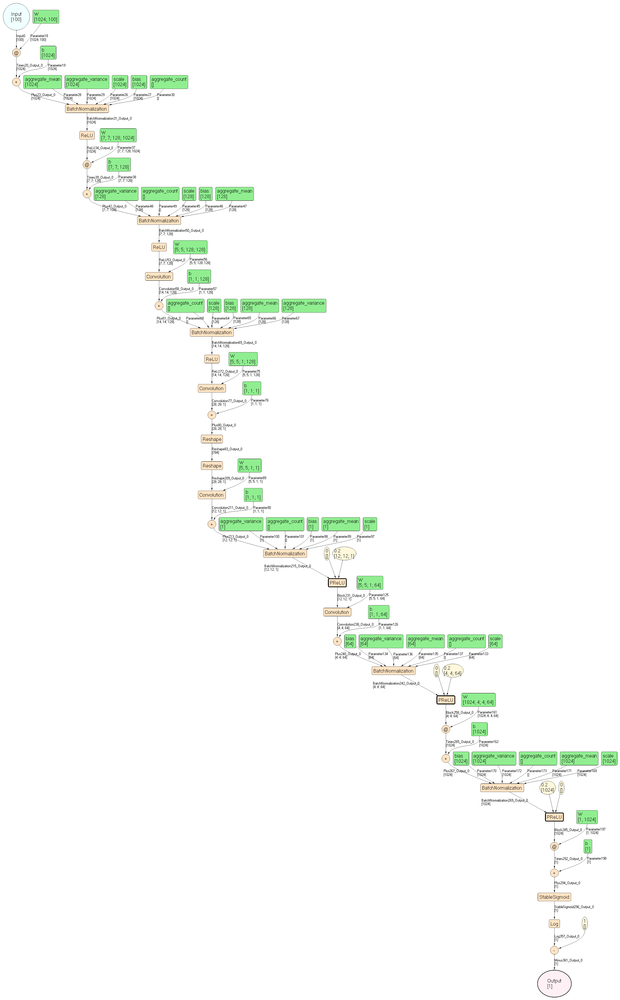
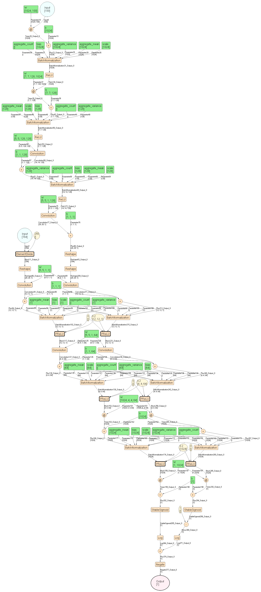
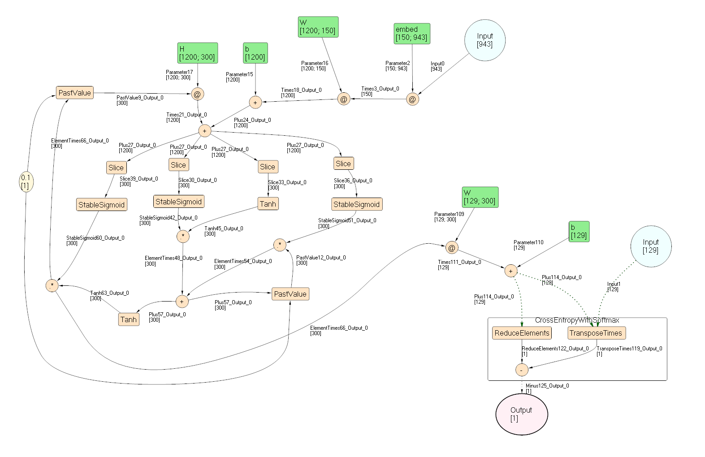

# FsCNTK

A F# functional wrapper over CNTK's .Net API

[very rough, incomplete and probably not fully correct at this stage]

## Model Examples

### GAN
[Train GAN to generate digits](FsCNTK/Scripts/TestDCGAN.fsx) - (requires GPU)

##### Generator Model

##### Discriminator Model

### LSTM
[LSTM for Language Understanding](FsCNTK/Scripts/TestLstm.fsx) - (requires GPU)
##### Model

